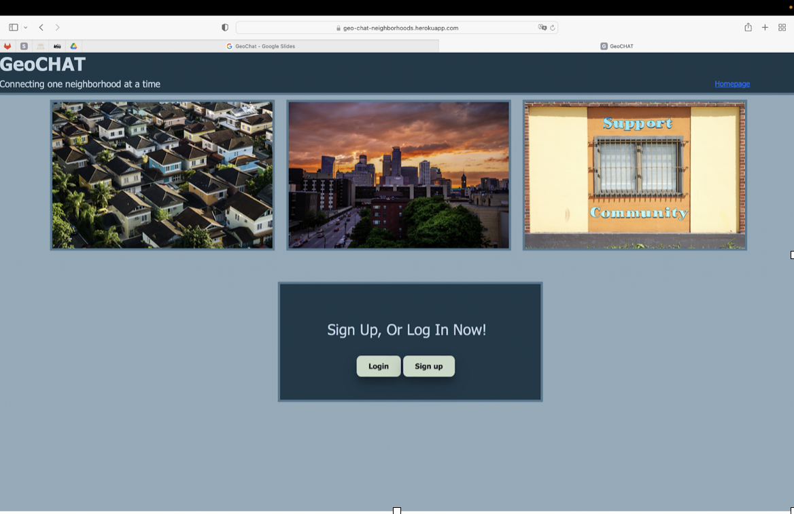

# Project-2_Neighborhood-group-chat

## Table of Contents  

- [Description](#Description)
- [Installation](#Installation)
- [Contributors](#Contributors)
- [Usage](#Usage)
- [Technologies](#Technologies)
- [Screenshot](#Screenshot)
- [Repository](#Repository) 
- [Live-App](#Live-app)
  
## Description
As a user, I want to create an application for neighbors to connect and join a group in their area. The appliction will allow then to post, edit and delete comments.

## Installation
NPM

## contributors
Mayra Ibarra
Rejene Giinther
Abyou Geletu
Carl McGee
Timi Ogundipe
Chris Lee

## usage
It is used to connect people with other members of their community.

## Technologies

- JavaScript
- HTML
- CSS
- Handlebars
- Node.js

## Screenshot

## repository

https://github.com/CarlJMcGee/Project-2_Neighborhood-group-chat

## Live App

[Visit my Heroku]()
